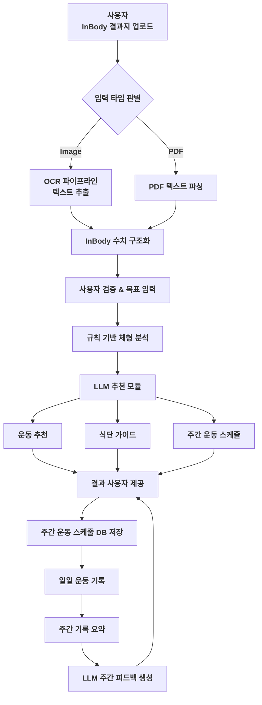
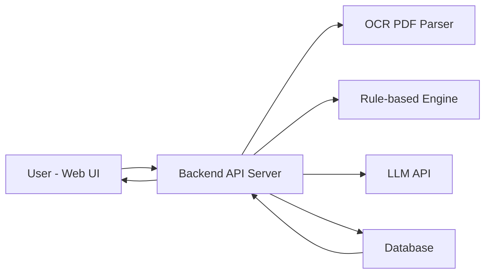

# flow chart

```mermaid
flowchart TB
    A["<b>사용자<br/>InBody 결과지 업로드</b>"] --> B{"<b>입력 타입 판별</b>"}
    B -- <b>Image</b> --> C["<b>OCR 파이프라인<br/>텍스트 추출</b>"]
    B -- <b>PDF</b> --> D["<b>PDF 텍스트 파싱</b>"]
    C --> E["<b>InBody 수치 구조화</b>"]
    D --> E
    E --> F["<b>사용자 검증 &amp; 목표 입력</b>"]
    F --> H["<b>규칙 기반 체형 분석</b>"]
    H --> J["<b>LLM 추천 모듈</b>"]
    J --> K["<b>운동 추천</b>"]
    J --> L["<b>식단 가이드</b>"]
    J --> M["<b>주간 운동 스케줄</b>"]
    K --> N["<b>결과 사용자 제공</b>"]
    L --> N
    M --> N
    N --> P["<b>주간 운동 스케줄 DB 저장</b>"]
    P --> Q["<b>일일 운동 기록</b>"]
    Q --> R["<b>주간 기록 요약</b>"]
    R --> S["<b>LLM 주간 피드백 생성</b>"]
    S --> N
```

# “System Architecture Diagram (High-level)”

```mermaid
flowchart LR
    User["User - Web UI"]
    Server["Backend API Server"]
    OCR["OCR PDF Parser"]
    Rule["Rule-based Engine"]
    LLM["LLM API"]
    DB["Database"]

    User --> Server
    Server --> OCR
    Server --> Rule
    Server --> LLM
    Server --> DB
    DB --> Server
    Server --> User
```
